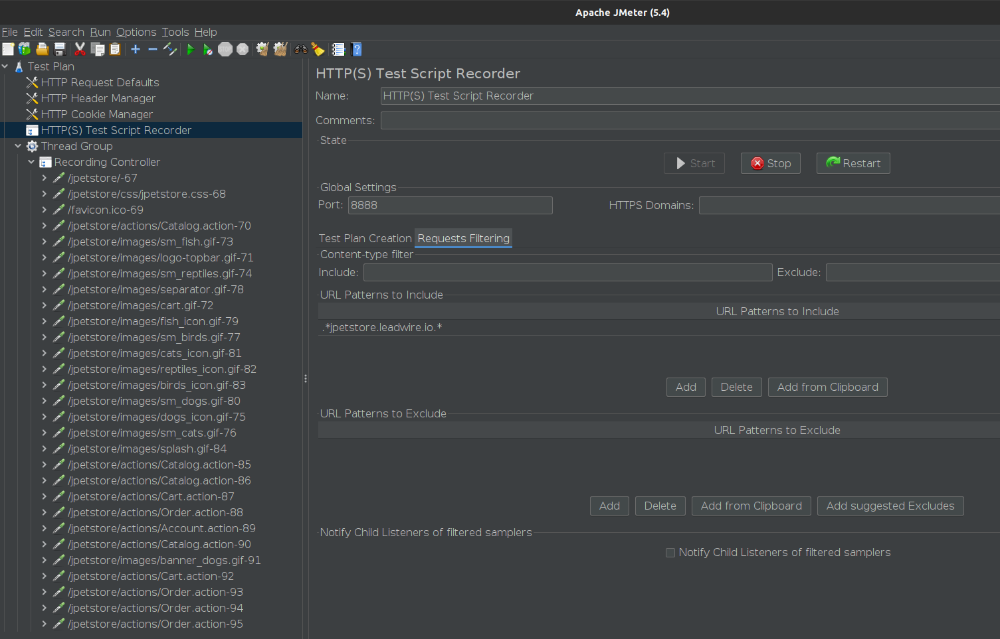
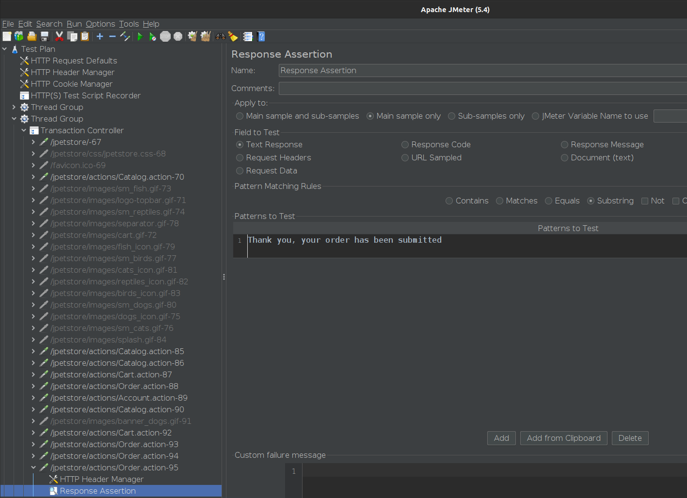
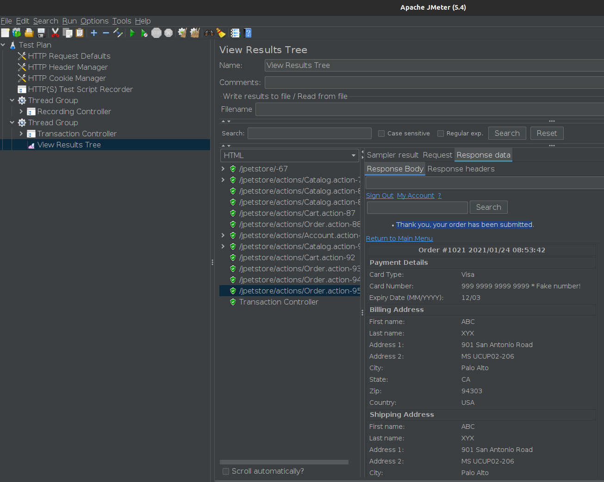

## Atelier-1 22-01-2021

Add HTTP Request Defaults

Add HTTP Header Manager

Add Cookie Manager

Add Threader group 

Add Recording Controller inside Threader group

Add HTTPS(S) Test Script Recorder and point the Target Controller to Test Plan -> Thread Group -> Recording Controller and Start saving samples

  

Add new Thread Group

Copy the Recording Controller from the first Thread Group and paste it into new Thread Group .

Change the pasted Recording Controller to Transaction Controller 

Select the sampler which allows you to display the page where there is the sentence on which you want to test its existence and add the Response Assertion

  

Add View Results Tree and Start 

  

